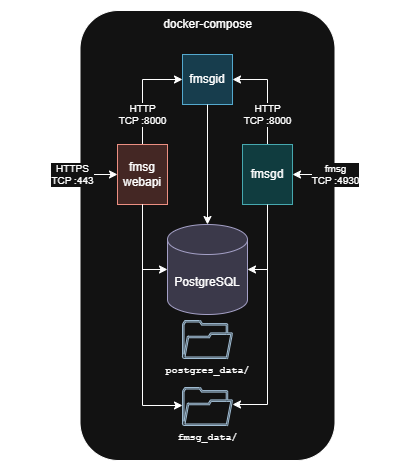

[](https://github.com/markmnl/fmsg-docker/actions/workflows/integration-test.yml)

# fmsg-docker

Dockerised stack composing a full fmsg setup including: [fmsgd](https://github.com/markmnl/fmsgd), [fmsgid](https://github.com/markmnl/fmsgid) and [fmsg-webapi](https://github.com/markmnl/fmsg-webapi)


<div align="center">
   <picture>
      <source media="(prefers-color-scheme: dark)" srcset="docs/fmsg-docker-dark.png">
      <source media="(prefers-color-scheme: light)" srcset="docs/fmsg-docker-light.png">
      
   </picture>
</div>

## Other Docs

| Name                                       | Description                                                        |
|--------------------------------------------|--------------------------------------------------------------------|
| [QUICKSTART.md](QUICKSTART.md)             | Get a production stack up and running on your server in minutes.   |
| [README_LOCAL_DEV.md](README_LOCAL_DEV.md) | Run the stack locally for development purposes.                    |


## Contents

- [Structure](#structure)
- [Services](#services)
- [Persistent Data Volumes](#persistent-data-volumes)
- [Integration Tests](#integration-tests)
- [Getting Started](#getting-started)
- [Environment Variables](#environment-variables)
  - [General](#general)
  - [Database](#database)
    - [Database Init Scripts](#database-init-scripts)

## Structure

```
fmsg-docker/
├── docker/
│   ├── fmsgd/
│   │   └── Dockerfile        # builds fmsgd from source
│   ├── fmsgid/
│   │   └── Dockerfile        # builds fmsgid from source
│   └── fmsg-webapi/
│       └── Dockerfile        # builds fmsg-webapi from source
│
├── compose/
│   ├── docker-compose.yml    # full fmsg stack
│   └── .env                  # environment configuration
│
└── README.md
```

## Services

| Service       | Description                                      |
|---------------|--------------------------------------------------|
| `postgres`    | PostgreSQL database shared by fmsgd, fmsgid and fmsg-webapi   |
| `fmsgid`      | fmsg Id HTTP API — manages users and quotas      |
| `fmsgd`       | fmsg host — sends and receives fmsg messages     |
| `fmsg-webapi` | fmsg Web API — HTTP interface to the fmsg db     |

## Persistent Data Volumes

The compose stack uses Docker named volumes:

| Volume          | Mounted at                 | Used by              | Contents                          |
|-----------------|----------------------------|----------------------|-----------------------------------|
| `postgres_data` | `/var/lib/postgresql/data`  | postgres             | All PostgreSQL databases and WAL  |
| `fmsg_data`     | `/opt/fmsg/data`            | fmsgd, fmsg-webapi   | fmsg host data (keys, messages)   |
| `fmsgid_data`   | `/opt/fmsgid/data`          | fmsgid               | fmsgid data (addresses CSV)       |
| `letsencrypt`   | `/etc/letsencrypt`          | certbot, fmsgd, fmsg-webapi | Let's Encrypt TLS certificates |

> **WARNING:** These volumes contain **sensitive application data** including user identities and messages. Restrict access to the Docker host and the volumes directory accordingly.
>
> Ensure you have a **backup plan** for both volumes. Data loss from a volume being deleted or corrupted is not recoverable without backups. Access to backups should equally restricted - consider encryption needs.

## Getting Started

1. Copy the example environment file and edit it:

   ```
   cp .env.example compose/.env
   ```

   Set all required variables in `compose/.env`:

   ```
   FMSG_DOMAIN=example.com
   CERTBOT_EMAIL=admin@example.com
   FMSG_API_TOKEN_ED25519_PRIVATE_KEY=<base64-ed25519-seed>
   FMSGD_WRITER_PGPASSWORD=<strong random password>
   FMSGID_WRITER_PGPASSWORD=<strong random password>
   ```

2. On the **first run**, supply the one-time initialisation passwords as command-line
   arguments rather than storing them in `.env`. From the `compose/` directory:

   ```
   PGPASSWORD=<superuser password> \
   FMSGD_READER_PGPASSWORD=<reader password> \
   FMSGID_READER_PGPASSWORD=<reader password> \
     docker compose up -d
   ```

   These variables are only needed during the first startup when the database
   volume is empty. Passing them on the command line keeps them out of files on
   disk. `PGUSER` defaults to `postgres` if not set.

3. On subsequent starts, only the `.env` file is needed:

   ```
   docker compose up -d
   ```

4. fmsgd will be available on port `4930` (or the port set by `FMSG_PORT` in `.env`).


## Integration Tests

End-to-end tests that spin up two full stacks (`hairpin.local` and `example.com`) on a shared Docker network and exchange messages between them using [fmsg-cli](https://github.com/markmnl/fmsg-cli). The test runner enables fmsg-webapi API-key auth, creates delegated API keys for the test actors during setup, and passes them to fmsg-cli with `FMSG_API_KEY`.

**Prerequisites:** Docker, docker compose, Go 1.24+, curl.

```bash
# Run tests (starts stacks fresh)
./test/run-tests.sh

# Run tests against already-running stacks (skips stack teardown, startup, and seeding)
./test/run-tests.sh --no-start

# Tear down stacks & network
./test/run-tests.sh cleanup

# Refresh local database DD scripts from component branches
FMSGD_REF=main FMSGID_REF=main FMSG_WEBAPI_REF=main ./scripts/update-dd.sh

# CI drift check for database DD scripts
./scripts/update-dd.sh --check
```

Tests also run on demand via the **Integration Test** GitHub Actions workflow.

## Environment Variables

Configure these in `compose/.env`. Variables marked **required** have no default and must be set.

### General

| Variable                     | Required | Default   | Description                                              |
|------------------------------|----------|-----------|----------------------------------------------------------|
| `FMSG_DOMAIN`                | yes      |           | The domain name for your fmsg host                       |
| `CERTBOT_EMAIL`              | yes      |           | Email address for Let's Encrypt certificate registration |
| `FMSG_API_TOKEN_ED25519_PRIVATE_KEY` | auth |      | Base64 Ed25519 seed/private key used to mint first-party JWTs from API keys |
| `FMSG_JWT_JWKS_URL`          | auth     |           | JWKS endpoint for external RS256 user JWT login          |
| `FMSG_JWT_ISSUER`            | JWKS     |           | Expected issuer for external user JWTs                   |
| `FMSG_JWT_AUDIENCE`          | JWKS     |           | Expected audience for external user JWTs                 |
| `FMSG_JWT_ADDRESS_CLAIM`     | JWKS     |           | Claim containing the fmsg address                        |
| `FMSG_PORT`                  | no       | `4930`    | Host port fmsgd listens on                               |
| `FMSGID_PORT`                | no       | `8080`    | Internal port for the fmsgid API                         |
| `GIN_MODE`                   | no       | `release` | Gin framework mode for fmsgid (`release` or `debug`)    |
| `FMSG_SKIP_DOMAIN_IP_CHECK`  | no       | `false`   | Skip domain-to-IP validation in fmsgd (useful for dev)   |

At least one auth mode is required for fmsg-webapi: API-key auth with `FMSG_API_TOKEN_ED25519_PRIVATE_KEY`, external user JWT auth with the JWKS variables, or both. API keys can be created or rotated with the fmsg-webapi operator command and used by fmsg-cli through `FMSG_API_KEY`.

### Database

The PostgreSQL instance hosts two separate databases (`fmsgd` and `fmsgid`) with dedicated roles per service.

| Variable                     | Required | Default    | Description                                                    |
|------------------------------|----------|------------|----------------------------------------------------------------|
| `PGUSER`                     | no       | `postgres` | PostgreSQL superuser name (used for first-run init only)       |
| `PGPASSWORD`                 | init     |            | PostgreSQL superuser password (only needed on first run)       |
| `FMSGD_WRITER_PGPASSWORD`    | yes      |            | Password for `fmsgd_writer` role (used by fmsgd & webapi)     |
| `FMSGD_READER_PGPASSWORD`    | init     |            | Password for `fmsgd_reader` role (only needed on first run)   |
| `FMSGID_WRITER_PGPASSWORD`   | yes      |            | Password for `fmsgid_writer` role (used by fmsgid)            |
| `FMSGID_READER_PGPASSWORD`   | init     |            | Password for `fmsgid_reader` role (only needed on first run)  |

Variables marked **init** are only required on the first startup when the database is being initialised. They can be passed as command-line environment variables (see [Getting Started](#getting-started)) to avoid storing them on disk.

#### Database Init Scripts

On first startup (empty data volume), PostgreSQL runs the scripts in `docker/postgres/init/` in order:

| Script               | Purpose                                               |
|----------------------|-------------------------------------------------------|
| `001-init.sh`        | Creates roles (with passwords from env) and databases |
| `002-fmsgd-dd.sql`   | Creates tables and other database objects for fmsgd   |
| `002-fmsgid-dd.sql`  | Creates tables and other database objects for fmsgid  |
| `003-fmsg-webapi-dd.sql` | Creates fmsg-webapi API-key grant tables          |
| `999-permissions.sql`| Grants permissions after all objects exist            |

> **WARNING:** To re-run initialisation you must remove the `postgres_data` volume.
> This **permanently destroys all data** in both the `fmsgd` and `fmsgid` databases
> — including user accounts, messages, and any other application state stored in
> PostgreSQL. Only do this if you intend to start from scratch.
>
> ```
> docker compose down
> docker volume rm <project>_postgres_data
> docker compose up -d   # supply init passwords again
> ```


